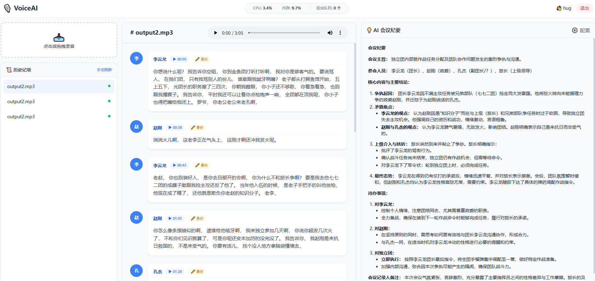

# 🎙️ AI-Powered Meeting Minutes & Speaker Identification System(VibeCoding)

本项目是一个基于 **FastAPI** 开发的智能会议管理系统。它集成了阿里 **FunASR** 语音识别技术、**CAM++** 声纹识别技术以及 **FAISS** 向量数据库，能够实现录音上传、自动分角色转文字（Diarization）、声纹入库比对，以及通过 LLM（如 DeepSeek / GPT）自动生成会议纪要。

---

## ✨ 核心功能

### 🔗 全链路语音处理

* 集成 VAD（静音检测）
* ASR（语音转文字）
* 标点恢复
  👉 一次性完成高质量语音解析

### 🧑‍🤝‍🧑 声纹识别与聚类

* 基于 CAM++ 模型提取声纹特征
* 支持“陌生人”自动识别
* 支持手动标注并持续学习

### ⚡ 高效率异步处理

* 使用 Python `Queue + Threading`
* 后台推理任务队列
* 不阻塞前端上传体验

### 🧠 动态 LLM 配置

* 支持在 UI 实时修改：

  * API Key
  * Base URL
  * Prompt 模板
* 兼容多种大模型（DeepSeek / GPT 等）

### 📝 Markdown 渲染

* 自动将 AI 生成的会议纪要
* 渲染为结构清晰、美观的 Markdown 格式

### 📊 系统监控

* 实时查看：

  * CPU 使用率
  * 内存占用
  * 任务队列状态

---

## 🛠️ 技术栈

| 模块    | 技术实现                             |
| ----- | -------------------------------- |
| 后端框架  | FastAPI, Python 3.12             |
| 数据库   | SQLAlchemy (SQLite), FAISS（向量检索） |
| 语音算法  | FunASR (Paraformer), CAM++（声纹提取） |
| 大模型集成 | OpenAI SDK（支持 DeepSeek / GPT 等）  |
| 前端界面  | Vue.js, Tailwind CSS, Marked.js  |
| 音频处理  | FFmpeg, Soundfile                |

---

## 📦 快速开始

### 1️⃣ 环境准备

确保系统已安装 FFmpeg（用于音频标准化）：

```bash
# Ubuntu / Linux
sudo apt update && sudo apt install ffmpeg -y
```

---

### 2️⃣ 安装依赖

建议使用虚拟环境运行：
```bash
conda create -n yy_rec python=3.12
```
```bash
pip install -r requirements.txt
```

---

### 🚀 启动项目（示例）

```bash
uvicorn main:app --host 0.0.0.0 --port 8000 
```
---
## 📌 项目亮点

* 🚀 端到端语音理解（无需复杂对齐）
* 🧠 声纹识别 + 向量检索实现身份识别
* 🔄 支持多模型灵活切换（LLM）

